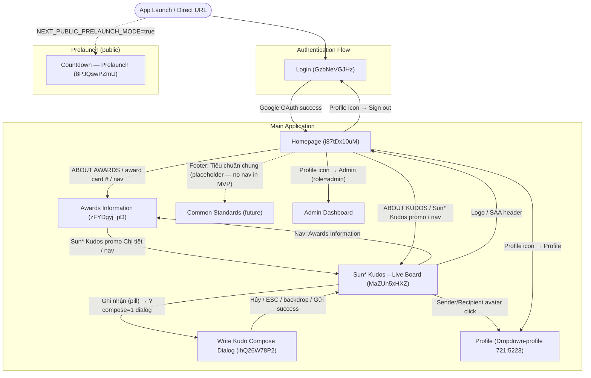
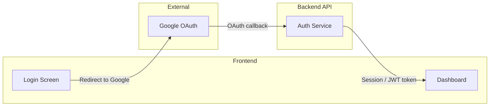

# Screen Flow Overview

## Project Info
- **Project Name**: Sun* Annual Awards 2025 (SAA 2025)
- **Figma File Key**: 9ypp4enmFmdK3YAFJLIu6C
- **Figma URL**: https://momorph.ai/files/9ypp4enmFmdK3YAFJLIu6C
- **Created**: 2026-04-20
- **Last Updated**: 2026-04-22

---

## Discovery Progress

| Metric | Count |
|--------|-------|
| Total Screens | - |
| Discovered | 6 |
| Remaining | - |
| Completion | - |

---

## Screens

| # | Screen Name | Frame ID | Figma Link | Status | Detail File | Predicted APIs | Navigations To |
|---|-------------|----------|------------|--------|-------------|----------------|----------------|
| 1 | Login | GzbNeVGJHz | https://momorph.ai/files/9ypp4enmFmdK3YAFJLIu6C/screens/GzbNeVGJHz | discovered | specs/GzbNeVGJHz-Login/ | POST /auth/google (OAuth callback) | Homepage |
| 2 | Homepage | i87tDx10uM | https://momorph.ai/files/9ypp4enmFmdK3YAFJLIu6C/screens/i87tDx10uM | discovered | specs/i87tDx10uM-Homepage/ | GET /api/event/config, GET /api/awards/categories, GET /api/notifications/summary | Awards Information, Sun* Kudos, Common Standards, Profile (Dropdown-profile), Admin Dashboard, Login (on sign-out) |
| 3 | Countdown (Prelaunch) | 8PJQswPZmU | https://momorph.ai/files/9ypp4enmFmdK3YAFJLIu6C/screens/8PJQswPZmU | discovered | specs/8PJQswPZmU-Countdown/ | none (public, uses NEXT_PUBLIC_EVENT_DATE) | — (terminal/standalone) |
| 4 | Awards Information | zFYDgyj_pD | https://momorph.ai/files/9ypp4enmFmdK3YAFJLIu6C/screens/zFYDgyj_pD | discovered | specs/zFYDgyj_pD-Awards/ | none (static i18n content; no backend calls) | Sun* Kudos, Login (on sign-out), Homepage (logo) |
| 5 | Sun* Kudos – Live Board | MaZUn5xHXZ | https://momorph.ai/files/9ypp4enmFmdK3YAFJLIu6C/screens/MaZUn5xHXZ | discovered | specs/MaZUn5xHXZ-KudosLiveBoard/ | GET /api/kudos/highlights, GET /api/kudos (paginated list), GET /api/kudos/spotlight-feed, GET /api/kudos/stats/me, GET /api/kudos/leaderboard/top10, POST /api/kudos/:id/reactions, POST /api/kudos/:id/copy-link (client-side), GET /api/sunners?search= | Kudos Compose (Send Kudo modal/screen — target TBD), Profile (avatar click on sender/recipient), Homepage (logo), Awards Information (nav), Login (sign-out) |
| 6 | Write Kudo (Compose dialog) | ihQ26W78P2 | https://momorph.ai/files/9ypp4enmFmdK3YAFJLIu6C/screens/ihQ26W78P2 | discovered | specs/ihQ26W78P2-KudosCompose/ | POST /api/kudos (create), POST /api/uploads (multipart), GET /api/sunners?search=, GET /api/kudos/hashtag-suggestions (predicted) | Live Board on close (Hủy / ESC / backdrop / Gửi success) |

---

## Navigation Graph

---

## Screen Groups

### Group: Authentication
| Screen | Purpose | Entry Points |
|--------|---------|--------------|
| Login | Google OAuth authentication for SAA 2025 | App launch, direct URL (unauthenticated) |

### Group: Prelaunch (Public)
| Screen | Purpose | Entry Points |
|--------|---------|--------------|
| Countdown — Prelaunch | Pre-event standalone countdown page (public, no auth) — displays DAYS/HOURS/MINUTES until event | `NEXT_PUBLIC_PRELAUNCH_MODE=true` short-circuits all routes here; or direct `/prelaunch` URL |

### Group: Main Application
| Screen | Purpose | Entry Points |
|--------|---------|--------------|
| Homepage | Main authenticated hub — hero + countdown, award categories grid, Sun* Kudos promo | Successful Google OAuth from Login; direct `/` while authenticated; SAA logo click from any authenticated page |
| Awards Information | Full detail of 6 award categories (title, image, description, quantity, prize value) with sidebar TOC | Homepage "ABOUT AWARDS" CTA, Homepage award card `/awards#<slug>`, Header/Footer "Awards Information" link |
| Sun* Kudos – Live Board | Public peer-recognition showcase — highlight carousel (3 featured kudos), live spotlight feed, All Kudos paginated list, user-stats + top-10 leaderboard sidebar | Homepage "ABOUT KUDOS" / Sun* Kudos promo / nav; Awards "Sun* Kudos promo Chi tiết" / nav; direct `/kudos` URL |
| Write Kudo Compose Dialog | Modal dialog over `/kudos` allowing a Sunner to send a Kudo: recipient search, danh hiệu (title), rich-text message, hashtags, up to 5 images, anonymous toggle, submit/cancel | `/kudos?compose=1` from "Ghi nhận" pill on Kudos Live Board |

---

## Screen Details

## Login (`GzbNeVGJHz`)
- **Entry**: Direct URL access or app launch when user is unauthenticated
- **Exit**: On successful Google OAuth login → redirects to authenticated Homepage
- **Triggers**: Click "LOGIN With Google" button initiates Google OAuth flow; successful OAuth callback redirects to Homepage

### UI Components
- Header: logo (left), language selector "VN" (right)
- Hero section: "ROOT FURTHER" branding image with tagline
- CTA: "LOGIN With Google" button (Google OAuth)
- Footer: copyright "Bản quyền thuộc về Sun* © 2025"

### Technical Notes
- Authentication method: Google OAuth (no username/password form)
- Language selector present (VN visible, toggles to EN)
- Unauthenticated-only screen — authenticated users should be redirected away

## Sun* Kudos – Live Board (`MaZUn5xHXZ`)
- **Entry**: Homepage "ABOUT KUDOS" CTA, Homepage Sun\* Kudos promo "Chi tiết" button, Homepage header/footer "Sun\* Kudos" nav link, Awards Information Kudos promo + nav. Protected route — unauthenticated users are redirected to `/login?returnTo=%2Fkudos`.
- **Exit**: "Ghi nhận" (Send Kudo) button → kudos compose screen/modal (TBD); sender/recipient avatar click → profile (TBD); Header/Footer nav → respective route; SAA logo → `/`; Profile Sign out → `/login`.
- **Triggers**: Highlight carousel prev/next buttons → paginate 3-up; emoji/heart reaction click → `POST /api/kudos/:id/reactions` + optimistic UI update; copy-link button → `navigator.clipboard.writeText` with shareable URL; spotlight feed auto-scrolls / updates in real-time (polling or SSE); search-sunner input filters spotlight + list.

### UI Components
- **Keyvisual (A)**: Full-width `KUDOS` wordmark hero with kudos-themed backdrop image (MM_MEDIA_KV Background, MM_MEDIA_Kudos logo).
- **Action bar (A.1 / A.2)**: "Ghi nhận" (Send Kudo) primary button with pen icon + "Tìm kiếm sunner" search input with search icon.
- **B_Highlight Kudos**: Section header + 3-up carousel of featured Kudo cards. Each card: sender avatar/name → arrow → recipient avatar/name, timestamp, category tag ("IDOL GIỚI TRẺ" etc.), message body, hashtags, emoji reaction buttons + heart count. Prev/next carousel controls (MM_MEDIA_Left, MM_MEDIA_Right) + page indicator.
- **B.7_Spotlight Board**: Large real-time feed panel showing recent Kudo activity (recipient name + timestamp pairs, e.g., "08:30PM Nguyễn Bá Chức đã nhận được một Kudos mới"). Includes total count header ("388 KUDOS"), pan/zoom controls, and a dedicated "Tìm kiếm sunner" search. Rendered over `Root further mo rong` backdrop.
- **C_All Kudos**: Vertical paginated list of 4+ Kudo posts per page. Each post card: sender/recipient avatars + names + role/tier badge (New Hero / Rising Hero / Super Hero / Legend Hero), timestamp, category hashtag (with pen icon), message body, attached images (up to 5 per post), hashtag list, action row (copy-link button + heart reaction count).
- **D_Right Sidebar (stats + leaderboard)**:
  - **D.1 Thống kê tổng quát** — personal Kudo stats: received count, sent count, total hearts, secret boxes opened, secret boxes unopened, "Mở quà" (open gift) CTA.
  - **D.3 10 SUNNER nhận quà** — top-10 leaderboard of Sunners receiving most Kudos / rewards.
- **Header (reused)**: `selectedNav="kudos"` — gold underline + glow on Sun\* Kudos link.
- **Footer (reused, minimal)**: logo + copyright only (per repo convention).

### Technical Notes
- **Real-time feed**: Spotlight Board shows recent activity — backend will need either a polling endpoint (e.g., `GET /api/kudos/spotlight-feed?since=<ts>`) or WebSocket/SSE for push updates. Polling @ 15-30s is acceptable for MVP.
- **Pagination**: All Kudos list uses offset or cursor pagination (`GET /api/kudos?cursor=&limit=20`). Design shows 4 entries — likely Load-more or infinite scroll.
- **Reactions**: Emoji/heart taps call `POST /api/kudos/:id/reactions` with `{ type: "heart"|"emoji_<name>" }`. Optimistic UI update, rollback on error.
- **Search**: Two distinct search inputs (header + spotlight). Both filter on Sunner name — predicts `GET /api/sunners?search=<q>&limit=10` autocomplete endpoint.
- **User tier badges**: MM_MEDIA_New Hero / Rising Hero / Super Hero / Legend Hero — driven by backend-computed tier based on stats. Enum: `tier: "new" | "rising" | "super" | "legend"`.
- **Copy-link**: Per-post copy-link is client-side (`navigator.clipboard.writeText`) producing a canonical URL like `/kudos/<kudo_id>` — no backend call needed.
- **Categories/Hashtags**: Kudos are tagged with categories ("IDOL GIỚI TRẺ", etc.) and free-form hashtags ("#Dedicated #Inspring..."). Categories may drive filtering in future iterations.
- **Gift / Secret boxes**: Gamification layer — users earn secret boxes for activity; opening a box likely triggers backend reveal (`POST /api/users/me/boxes/:id/open`). The D.1.8 "Mở quà" button opens the nearest unopened box.
- **Localization**: Vietnamese-first content visible in mock. i18n keys under `kudos.*` namespace predicted.

### Predicted APIs
| Endpoint | Method | Purpose |
|----------|--------|---------|
| `/api/kudos/highlights` | GET | 3 featured kudos for B_Highlight carousel |
| `/api/kudos/spotlight-feed` | GET | Recent activity stream for Spotlight Board; supports `since=<ts>` polling |
| `/api/kudos` | GET | Paginated All Kudos list (`?cursor=&limit=`); filter by category/hashtag optional |
| `/api/kudos/stats/me` | GET | Current user stats: `{ received, sent, hearts, boxes_opened, boxes_unopened }` |
| `/api/kudos/leaderboard/top10` | GET | Top 10 Sunners receiving most Kudos + rewards |
| `/api/kudos/:id/reactions` | POST | Add reaction (heart / emoji) — `{ type }`; returns updated count |
| `/api/kudos/:id` | GET | (future) Individual kudos detail — for share-link landing |
| `/api/sunners?search=` | GET | Autocomplete for search-sunner inputs |
| `/api/users/me/boxes/:id/open` | POST | Open a secret gift box (gamification) |

## Write Kudo Compose Dialog (`ihQ26W78P2`)
- **Entry**: Kudos Live Board "Ghi nhận" pill → URL `/kudos?compose=1` opens modal overlay. Protected route (inherits auth from `/kudos`).
- **Exit**: "Hủy" button or ESC or backdrop click → close modal + remove `?compose=1`; "Gửi" success → `POST /api/kudos` → close + Live Board refetch.
- **Triggers**: Recipient search debounce → `GET /api/sunners?search=`; hashtag add → `GET /api/kudos/hashtag-suggestions` (predicted); image add → `POST /api/uploads` per file; submit → `POST /api/kudos` with full payload.

### UI Components (per design-style.md to be authored)
- **Modal shell** (`520:11647`): centered dialog, dark backdrop mask, close on ESC/backdrop/Hủy.
- **A. Title** (`I520:11647;520:9870`): "Gửi lời cám ơn và ghi nhận đến đồng đội" (h2, gold/white, centered).
- **B. Người nhận*** (`I520:11647;520:9871`): required recipient autocomplete search with dropdown caret.
- **Danh hiệu*** (`I520:11647;1688:10448`): required title input — placeholder "Dành tặng một danh hiệu cho đồng đội" + helper text "Ví dụ: Người truyền động lực cho tôi. Danh hiệu sẽ hiển thị làm tiêu đề của Kudos của bạn."
- **C. Rich-text toolbar** (`I520:11647;520:9877`): Bold, Italic, Strikethrough, Number list, Link, Quote icons + right-aligned "Tiêu chuẩn cộng đồng" text link.
- **D. Textarea** (`I520:11647;520:9886`): required, placeholder "Hãy gửi gắm lời cám ơn và ghi nhận đến đồng đội tại đây nhé!"; supports `@<name>` mentions.
- **D.1. Helper**: "Bạn có thể '@+tên' để nhắc tới đồng nghiệp khác."
- **E. Hashtag*** (`I520:11647;520:9890`): required tag chips + "+ Hashtag" add button, max 5, "Tối đa 5" hint.
- **F. Image** (`I520:11647;520:9896`): optional gallery of up to 5 thumbnails with X-remove buttons + "+ Image" add button (hidden at 5), "Tối đa 5" hint.
- **G. Anonymous checkbox** (`I520:11647;520:14099`): "Gửi lời cám ơn và ghi nhận ẩn danh".
- **H. Footer** (`I520:11647;520:9905`): "Hủy" (text + close icon) + "Gửi" (gold pill + send icon). "Gửi" disabled while required fields empty.

### Technical Notes
- **Modal overlays** `/kudos` — the Live Board stays mounted behind the backdrop. URL `?compose=1` keeps state deep-linkable (back-button closes dialog).
- **New Kudo field `title` (Danh hiệu)**: the Figma description says "Danh hiệu sẽ hiển thị làm tiêu đề của Kudos của bạn" — this is a distinct title field, NOT a hashtag. Kudo schema extends: `{ … title: string (max N chars), … }`. Migration addendum required: `ALTER TABLE public.kudos ADD COLUMN title text NOT NULL DEFAULT ''`. Live Board display needs to show `kudo.title` as the category/headline chip (currently hashtags[0] is rendered as category chip — swap for `title`).
- **Rich-text editor**: minimal HTML subset (bold/italic/strikethrough/ordered-list/link/blockquote). Serialize as sanitized HTML or Markdown. Sanitize server-side before store. `@mentions` resolved against `/api/sunners` and stored as `{ id, display_name }` references in content.
- **Hashtag input**: typeahead with suggestions from `GET /api/kudos/hashtag-suggestions` (distinct top-N hashtags). User can also free-type new tags (free-form per D3 resolved decision).
- **Images**: uploaded via `POST /api/uploads` (multipart, existing endpoint). Store returned URL in `attachment_urls[]` on submit.
- **Anonymous mode**: when checkbox enabled, backend stores `sender_id` as-is BUT Live Board rendering hides sender (displays "Ẩn danh" placeholder). A `is_anonymous boolean` column on `kudos` table.
- **Validation** (client + server via Zod):
  - `recipient_id`: required UUID, must NOT equal `auth.uid()`.
  - `title`: required, 1–80 chars.
  - `message`: required, 10–2000 chars; sanitized HTML.
  - `hashtags`: required, 1–5 items, each 1–32 chars.
  - `attachment_urls`: optional, 0–5 items, each must match `POST /api/uploads` response origin.
  - `is_anonymous`: boolean, default false.
- **On submit success**: invalidate Live Board caches (highlights + list cursor + spotlight + stats). New Kudo becomes visible within one poll cycle or immediately after the list refetch.
- **Error handling**: 400 → inline field errors; 403/409 (e.g. self-kudo blocked) → form-level error toast; 500 → retry toast.

### Predicted APIs
| Endpoint | Method | Purpose |
|----------|--------|---------|
| `/api/kudos` | POST | Create a Kudo (existing; extend payload with `title` + `is_anonymous`) |
| `/api/uploads` | POST | Multipart image upload (existing) |
| `/api/sunners` | GET | Recipient autocomplete (existing) |
| `/api/kudos/hashtag-suggestions` | GET | **NEW** — top-N distinct hashtags for typeahead |
| `/api/kudos/filters` | GET | (alternative) Could reuse for hashtag options |

## Awards Information (`zFYDgyj_pD`)
- **Entry**: Homepage "ABOUT AWARDS" CTA, any of the 6 Homepage award cards (linking via `/awards#<slug>`), Header "Awards Information" link, Footer "Awards Information" link. Protected route — unauthenticated users are redirected to `/login?returnTo=%2Fawards`.
- **Exit**: Sun\* Kudos promo "Chi tiết" → `/kudos`; Header/Footer nav → respective route; SAA logo → `/`; Profile Sign out → `/login`.
- **Triggers**: Sidebar item click → smooth scroll to matching card + URL hash update via `history.replaceState`; manual scroll → IntersectionObserver-based scroll-spy updates active sidebar item.

### UI Components
- **Header (reused)**: `selectedNav="awards"` — gold underline + glow on the "Awards Information" link.
- **Hero Keyvisual (3)**: Full-width ROOT FURTHER artwork `1440 × 547` + logo overlay. No countdown / no CTA / no event info (pure banner).
- **Title block (A)**: Caption "Sun\* annual awards 2025" (16/700) + 1 px divider (`#2E3940`) + H1 "Hệ thống giải thưởng SAA 2025" (57/700 ls -0.25 gold w/ glow).
- **Main 2-col (B)**:
  - **Sidebar (C)** — 178 px wide, 6 nav items (Target icon + label), sticky `top: 104 px` on desktop, hidden on <1024 px. Active state: gold text + gold underline + gold glow.
  - **Cards column (D)** — 853 px wide, 6 stacked award cards (Top Talent, Top Project, Top Project Leader, Best Manager, Signature 2025 – Creator, MVP). Each card: 336×336 gold-bordered picture (left) + backdrop-blur(32px) content block (right) with title, justified description, 36/700 numeric rows for quantity + prize value.
- **Sun\* Kudos promo (reused)**: Same as Homepage D1.
- **Footer (reused)**: `selectedNav="awards"`.

### Technical Notes
- All 6 award categories are **static i18n content** — no backend calls. Quantity/unit/value stored in `src/lib/data/awards-details.ts`; localized strings in `awards.*` namespace.
- Currency formatted via `Intl.NumberFormat` (VN uses `.` separator + `VNĐ`; EN uses `,` + `VND`).
- Scroll-spy uses `IntersectionObserver` with `rootMargin: "-80px 0px -50% 0px"` so the active card is whichever one occupies the upper half of the viewport below the header.
- Smooth scroll honors `prefers-reduced-motion: reduce` (instant scroll when set).
- No new colors, no new fonts — 2 new typography tokens (`--text-award-value` 36/700/44, `--text-award-description` 16/700 justified) + 12 new spacing tokens.
- **Signature 2025 – Creator** card has two prize tiers (5M individual / 8M team) rendered as two rows inside the Value section.

## Homepage (`i87tDx10uM`)
- **Entry**: Successful Google OAuth callback from Login; direct `/` URL when authenticated; SAA logo click from any authenticated page
- **Exit**: "ABOUT AWARDS" / "Awards Information" / award card → `/awards`; "ABOUT KUDOS" / "Sun* Kudos" promo → `/kudos`; Footer "Tiêu chuẩn chung" → `/standards` (route TBD); Profile → `/profile` (or `/admin` if admin role); Sign out → `/login`
- **Triggers**: Countdown to event auto-updates; click CTAs / cards / nav links triggers navigation

### UI Components
- **Header (A1)**: logo, 3 nav links (About SAA 2025 selected, Awards Information, Sun* Kudos), notification bell with unread-count red dot, language selector (VN/EN), profile avatar (dropdown: Profile, Sign out, Admin Dashboard)
- **Hero Keyvisual (3.5)**: full-width decorative image, "ROOT FURTHER" title, "Coming soon" label, countdown (DAYS/HOURS/MINUTES 2-digit glass tiles), event info (time, location, broadcast note), CTA pair (ABOUT AWARDS primary, ABOUT KUDOS outline)
- **ROOT FURTHER description (B4)**: multi-line paragraph explaining the campaign
- **Awards section (C1 + C2)**: section header + 3×2 grid of 6 award cards (Top Talent, Top Project, Top Project Leader, Best Manager, Signature 2025 - Creator, MVP) — each with image, title, 2-line description, "Chi tiết" link
- **Sun* Kudos promo (D1)**: horizontal card — label, title, body, CTA, decorative "KUDOS" wordmark, media
- **Widget floating button (6)**: fixed bottom-right, gold pill, quick-actions menu trigger (placeholder for MVP)
- **Footer (7)**: logo, 4 nav links (About SAA 2025, Awards Information, Sun* Kudos, Tiêu chuẩn chung), copyright

### Technical Notes
- All user-visible text rendered through `next-intl` (`homepage.*`, `nav.*`, `footer.*`, `common.*` namespaces)
- Countdown computed client-side from `NEXT_PUBLIC_EVENT_DATE` (ISO 8601); updates every minute; freezes at 00 when target passes
- Time values formatted via `Intl.DateTimeFormat` (VN: "18h30", EN: "6:30 PM")
- All icons/images rendered through `<Icon>` component
- New font dependencies: "Digital Numbers" (countdown), "SVN-Gotham" (decorative wordmark only)
- Gold-glow box-shadow / text-shadow is a distinctive visual signature reused across card hovers, widget button, selected nav

---

## API Endpoints Summary

| Endpoint | Method | Screens Using | Purpose |
|----------|--------|---------------|---------|
| /auth/google | GET/POST | Login | Initiate / handle Google OAuth flow |
| /auth/callback | GET | Login | OAuth redirect callback, issues session/token |
| /api/event/config | GET | Homepage | Return event datetime + location + broadcast channel (localizable) |
| /api/awards/categories | GET | Homepage, Awards Information | Return 6 award categories with localized title/description + image URLs |
| /api/notifications/summary | GET | Homepage (any authenticated screen with header) | Return `{ unread_count }` for header bell badge |
| /api/kudos/highlights | GET | Kudos Live Board | 3 featured Kudos for Highlight carousel |
| /api/kudos/spotlight-feed | GET | Kudos Live Board | Real-time recent activity stream (polling `?since=<ts>` or SSE) |
| /api/kudos | GET | Kudos Live Board | Paginated All Kudos list (`?cursor=&limit=`) |
| /api/kudos/stats/me | GET | Kudos Live Board | Current user stats — received/sent/hearts/boxes |
| /api/kudos/leaderboard/top10 | GET | Kudos Live Board | Top-10 Sunners receiving most Kudos/rewards |
| /api/kudos/:id/reactions | POST | Kudos Live Board | Add heart/emoji reaction to a Kudo |
| /api/sunners?search= | GET | Kudos Live Board | Autocomplete Sunner search for both search inputs |
| /api/users/me/boxes/:id/open | POST | Kudos Live Board | Open a secret gift box (gamification) |
| /api/kudos | POST (compose-side extended) | Write Kudo dialog | Extend existing create endpoint with `title` + `is_anonymous` fields |
| /api/kudos/hashtag-suggestions | GET | Write Kudo dialog | Typeahead for hashtag add (predicted; may reuse `/api/kudos/filters`) |

---

## Data Flow

---

## Technical Notes

### Authentication Flow
- Google OAuth 2.0 based authentication
- No traditional username/password
- Token/session issued after successful OAuth callback

### Routing
- Login screen is the unauthenticated entry point
- Authenticated users should be redirected from Login to Dashboard

---

## Discovery Log

| Date | Action | Screens | Notes |
|------|--------|---------|-------|
| 2026-04-20 | Initial discovery | Login | Auth flow entry point, Google OAuth only |
| 2026-04-21 | Spec added | Homepage | Hero + countdown, 6 award cards, Sun* Kudos promo, global header/footer/widget; i18n is first-class |
| 2026-04-21 | Spec added | Countdown — Prelaunch | Standalone public prelaunch page; 1.5× scale of Homepage countdown; reuses Countdown components with `size` variant |
| 2026-04-21 | Spec added | Awards Information | Awards detail page `/awards` with sidebar TOC + 6 award cards (Top Talent / Top Project / Top Project Leader / Best Manager / Signature 2025 / MVP); static i18n content; no backend calls; deep-link via `/awards#<slug>` from Homepage cards |
| 2026-04-22 | Screen discovered | Sun* Kudos – Live Board | Public peer-recognition showcase `/kudos` — 3-up Highlight carousel, real-time Spotlight Board feed, paginated All Kudos list, user-stats + top-10 leaderboard sidebar, "Ghi nhận" CTA to compose screen. Backend-heavy: 9 predicted endpoints incl. reactions, pagination, polling feed, gift boxes |
| 2026-04-22 | Implementation complete | Sun* Kudos – Live Board | All 143 tasks completed. Frontend: 28 components + 5 hooks + pure modules (tier/spotlight-layout). Backend: 5 Supabase migrations + 12 Route Handlers + 13 RPCs. Tests: 126 passing across 28 suites + E2E spec authored. `zod` added as single justified dependency. MVP scope ships. |
| 2026-04-22 | Screen discovered | Write Kudo Compose Dialog | Modal dialog overlaying `/kudos` for composing a new Kudo — 7 form fields (recipient / danh hiệu title / message / hashtags / images / anonymous toggle). Introduces NEW `kudos.title` + `kudos.is_anonymous` schema fields; extends existing `POST /api/kudos` endpoint. Requires hashtag-suggestions endpoint. |

---

## Next Steps

- [x] Discover Homepage (i87tDx10uM) — spec and design-style complete
- [x] Discover Awards Information detail screen (zFYDgyj_pD) — spec and design-style complete
- [x] Discover Sun* Kudos – Live Board (MaZUn5xHXZ) — SCREENFLOW entry complete; spec.md + design-style.md pending via `/momorph.specify`
- [x] Discover Write Kudo Compose Dialog (ihQ26W78P2) — SCREENFLOW entry complete; spec.md + design-style.md pending via `/momorph.specify`. **Note**: introduces `kudos.title` and `kudos.is_anonymous` schema additions — migration addendum required on Kudos Live Board backend.
- [ ] Discover Profile / Admin Dashboard screens (targets of profile dropdown)
- [ ] Specify backend APIs (`event/config`, `awards/categories`, `notifications/summary`, and full `kudos/*` surface) or agree on MVP stub strategy
- [x] Confirm language switcher target behavior — cookie `NEXT_LOCALE` with 1-year max-age, locale prefix "never", homepage fully i18n-enabled
