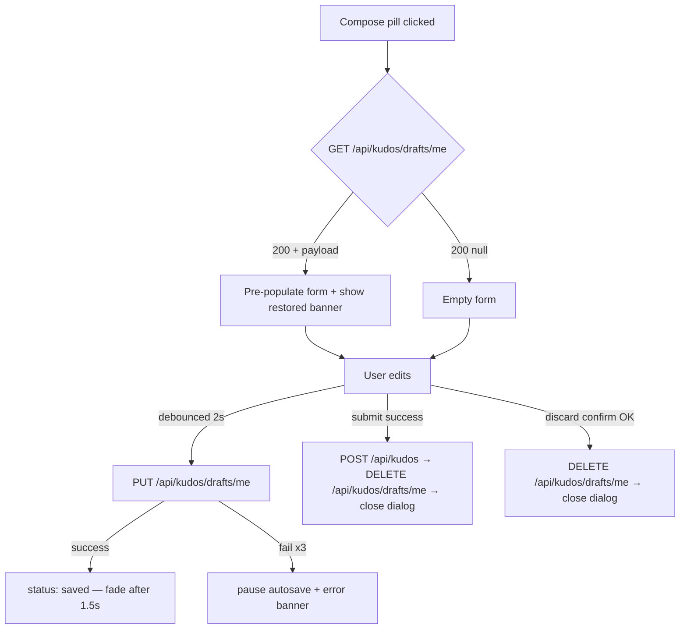

# Implementation Plan: Write Kudo Compose Dialog (`/kudos?compose=1`)

**Frame**: `ihQ26W78P2-KudosCompose` (Figma `520:11602` → modal `520:11647`)
**Date**: 2026-04-22
**Spec**: `spec.md`
**Design**: `design-style.md`

---

## Summary

Replace the shipped `KudosComposePlaceholder` on the Kudos Live Board with a full compose dialog: 7 form fields (Người nhận / Danh hiệu / markdown message / hashtags / images / anonymous / submit) rendered inside a 752 × 1012 modal overlay. Content is stored as **raw markdown** (no HTML sanitization dependency — `react-markdown` handles safe render). **DB-backed drafts** auto-save every 2 s keyed by `user_id`. Extends the existing Kudos schema with `title` + `is_anonymous` columns and adds a new `kudo_drafts` table.

**Key technical posture**: this feature adds **2 justified npm dependencies** (`@uiw/react-md-editor` for edit + `react-markdown` for Live Board render) on top of the existing `zod`. All other behavior uses existing deps + patterns from the Kudos Live Board ship.

Primary risks: (a) markdown editor + custom-toolbar wiring complexity (hiding default toolbar + wiring our Section-C icons to the editor command API); (b) mention popover inside a 3rd-party editor's textarea (cursor-anchored positioning); (c) backward-compat for legacy plain-text messages in Live Board cards (`react-markdown` handles this gracefully for basic text); (d) draft-state race conditions across tabs (scope-limited by single-draft-per-user PK).

---

## Technical Context

**Language/Framework**: TypeScript 5.x (strict) / Next.js 16 App Router (Turbopack) / React 19.2
**Primary Dependencies** (existing): `next-intl v4`, `@supabase/ssr`, `zod`, TailwindCSS v4, Jest 30, `@playwright/test`, `axe-playwright`
**New Dependencies** (2): `@uiw/react-md-editor ^4.x`, `react-markdown ^10.x` — approved per spec D7
**Database**: PostgreSQL via Supabase — adds 2 columns to `kudos` + 1 new table (`kudo_drafts`).
**Testing**: Jest + RTL (unit), Playwright + axe (E2E), API integration tests (node jest env).
**State Management**: React local state in the compose dialog; URL state via `useUrlState` for `?compose=1`; auto-save state machine in `useDraftAutosave`.
**API Style**: REST. 3 new Route Handlers for drafts CRUD; existing `POST /api/kudos` extended with `title` + `is_anonymous`.

---

## Constitution Compliance Check

*GATE: Must pass before implementation can begin*

| Requirement | Constitution Rule | Status |
|-------------|-------------------|--------|
| Clean code & source organization (Principle I) | Feature-first folder `src/components/kudos/`; kebab-case files, PascalCase components | ✅ Compliant — extends existing Kudos feature folder |
| Platform-appropriate UI (Principle II) | Tailwind + `@theme` tokens; no hardcoded colors/spacing/typography | ✅ Compliant — new tokens listed in `design-style.md` |
| Test-first / TDD (Principle III) | Every user story gets at least one failing test before implementation | ✅ Planned per phase breakdown |
| Supabase integration (Principle IV) | Auth via existing helper; RLS on `kudo_drafts` enforced per-user; no raw SQL outside migration | ✅ Planned |
| OWASP secure coding (Principle V) | Zod input validation; no localStorage for session tokens; markdown content rendered with raw-HTML disabled; URL allow-list; self-recipient blocked server-side | ✅ Planned |
| TypeScript `type` not `interface` | Per CLAUDE.md | ✅ Compliant |
| Library additions justified | Per CLAUDE.md "Library additions MUST be justified" | ✅ Compliant — 2 deps approved in spec D7 with bundle-size + use-case justification; same bar as the earlier `zod` addition |

**Violations**: None. The 2 new npm deps are approved per spec D7.

---

## Architecture Decisions

### Frontend Approach

- **Component Structure**: All new components under `src/components/kudos/` (extends existing folder). Atomic composition:
  - Primitives: `<DraftStatusIndicator>`, `<DraftRestoredBanner>`, `<AnonymousCheckbox>`, `<ComposeSubmitButton>`, `<ComposeCancelButton>`
  - Molecules: `<RecipientPicker>`, `<KudoTitleInput>`, `<MarkdownToolbar>`, `<MentionPopover>`, `<HashtagPicker>`, `<ImageUploader>`
  - Editor wrapper: `<MarkdownEditor>` — thin wrapper over `@uiw/react-md-editor` with our toolbar replacement
  - Organism: `<KudosComposeDialog>` — composes the above + drives submit / draft state
  - Shared read-side: `<KudoMarkdown>` — wraps `react-markdown` with the mention + safe-link renderer; replaces the `<p>{kudo.message}</p>` render in Live Board cards
- **Dialog shell**: reuse existing `<Dialog>` primitive from `src/components/ui/` (already trap-focus + ESC + backdrop-click + body-scroll-lock). **API change required**: add an optional `onRequestClose?: (reason: "esc" | "backdrop" | "button") => boolean | Promise<boolean>` prop — returns/resolves `false` to veto the close. Existing callers (`GiftModal`, `Lightbox`, `KudosComposePlaceholder`) pass no handler and retain current behavior. `<KudosComposeDialog>` passes the discard-confirm check through it. Test: `Dialog.test.tsx` extended for the `onRequestClose` veto path.
- **Markdown editor**: `@uiw/react-md-editor` with `hideToolbar={true}` + `preview="edit"` + `visibleDragbar={false}`. Our `<MarkdownToolbar>` calls the editor's command API (`executeCommand(commands.bold)` etc.) to toggle formatting. Mentions use a custom plugin that detects `@` keystrokes and opens the popover anchored to the caret.
- **Styling**: Tailwind v4 utility classes bound to new CSS variables in `globals.css @theme`. Token inventory per `design-style.md`.
- **Data fetching**: direct `fetch()` calls (no SWR). Optimistic UX for heart/copy-link (from Live Board) not relevant here — submit is a blocking one-shot. Draft auto-save has its own state machine (idle/saving/saved/error).
- **URL state**: `useUrlState("compose", { mode: "push" })` — already in place from Live Board; Back-button closes dialog.
- **Discard-confirm flow**: when Hủy / ESC / backdrop click fires on a dirty form, mount a small nested confirm `<Dialog>` (new `<DiscardConfirmDialog>`). OK → clear draft → close compose. Cancel → dismiss confirm, keep compose open.

### Backend Approach

**API Design**: REST. 3 new Route Handlers + 1 extended:

- `GET /api/kudos/drafts/me` — returns `{ payload, updated_at } | null`.
- `PUT /api/kudos/drafts/me` — upsert draft; body is `ComposeFormState.payload` (validated by Zod `DraftPayloadSchema` — subset of `CreateKudoSchema` with all fields optional).
- `DELETE /api/kudos/drafts/me` — delete draft (idempotent).
- `POST /api/kudos` (existing) — extended with `title` + `is_anonymous`; mention UUIDs validated; self-recipient blocked.

**Database**: 1 migration file.

| Change | Detail |
|--------|--------|
| `kudos.title` | `text NOT NULL DEFAULT ''` + `CHECK (char_length(title) <= 80)` |
| `kudos.is_anonymous` | `boolean NOT NULL DEFAULT false` |
| `kudo_to_json()` RPC | Update to include `title` + `is_anonymous`; mask sender fields when `is_anonymous = true` |
| `kudo_drafts` | `user_id uuid PK REFERENCES profiles(id) ON DELETE CASCADE; payload jsonb NOT NULL; updated_at timestamptz NOT NULL DEFAULT now()` — one active draft per user |
| `kudo_drafts` RLS | SELECT/INSERT/UPDATE/DELETE all `user_id = auth.uid()` only |
| Trigger `touch_kudo_drafts_updated_at` | BEFORE UPDATE → `NEW.updated_at = now()` |

Validation: server-side Zod extensions (`CreateKudoSchema` + new `DraftPayloadSchema`). Message is stored as plain markdown text — no HTML sanitization step.

### Integration Points

- **Existing shared components** (verified in repo):
  - `<Dialog>` — already has focus-trap / ESC / backdrop / scroll-lock. Need to add an optional `onRequestClose` callback that the compose dialog uses to trigger the discard-confirm before invoking `onClose`.
  - `<Toast>` + `<ToastProvider>` — reused from Kudos Live Board (same `ToastProvider` already wraps the page).
  - `Icon` — reused for all icons.
  - `useUrlState("compose")` — already wired in `KudosPageClient`.
  - `useClipboard`, `useDebouncedValue` — reused.
- **New data layer**:
  - `src/types/kudos.ts` — extend `Kudo` with `title` + `is_anonymous`; add `KudoDraft` + `ComposeFormState` types.
  - `src/lib/services/kudos-validation.ts` — extend `CreateKudoSchema`; add `DraftPayloadSchema`.
  - `src/lib/services/kudos-service.ts` — extend `createKudo(input)` signature; add `getDraft()`, `putDraft(payload)`, `deleteDraft()`.
  - `src/lib/kudos/mentions.ts` — pure module: parse / serialize `@[Name](user:uuid)`, extract mention UUIDs, strip invalid mention tokens.
- **Live Board read-path migration**: `KudosHighlightCard` + `KudosPostCard` swap their plain-text `<p>{message}</p>` render for `<KudoMarkdown>{message}</KudoMarkdown>`. Legacy rows with plain-text messages render unchanged (markdown is a superset). **Note**: this is a one-line change per card + a new shared renderer.

### State Management

| State | Scope | Source | Updater |
|-------|-------|--------|---------|
| `composeOpen` | URL `?compose=1` + `<KudosPageClient>` local | URL via `useUrlState` | Pill click / close / popstate |
| `formState` | `<KudosComposeDialog>` `useState` + `useReducer` | initial from GET draft, else empty | Per-field change |
| `recipientQuery` | `<RecipientPicker>` `useState` | Input | Debounced 200 ms |
| `recipientSuggestions` | `<RecipientPicker>` `useState` | `GET /api/sunners?search=` | Effect on debounced query |
| `mentionState` | `<MarkdownEditor>` `useReducer` | Keystroke tracking | Detect `@`; open popover; resolve via `/api/sunners` |
| `hashtagSuggestions` | `<HashtagPicker>` `useState` | `GET /api/kudos/filters` (cached on dialog mount) | On `+ Hashtag` click |
| `uploads` | `<ImageUploader>` `useReducer` | Per-file state machine: `queued \| uploading \| done \| error` | File picker + retry |
| `draftStatus` | `<KudosComposeDialog>` via `useDraftAutosave` | idle → saving → saved → error → offline → paused | Debounced 2 s on formState change; online/offline events; 3-fail backoff |
| `showRestoredBanner` | `<KudosComposeDialog>` `useState` | initial GET draft response non-null | Auto-dismiss after 3 s |
| `showDiscardConfirm` | `<KudosComposeDialog>` `useState` | Close attempt on dirty state | Confirm OK / Cancel |
| `submitInFlight` | `<KudosComposeDialog>` `useRef` + `useState` | Submit click | Blocks double-submit |
| Toasts | Shared `<ToastProvider>` | Via `useToast()` | Submit success / errors |

No new global store needed.

### Navigation & History Strategy

| Trigger | History op | Rationale |
|---------|------------|-----------|
| "Ghi nhận" pill click | `pushState("?compose=1")` | Back-button closes dialog (already implemented) |
| Hủy / ESC / backdrop (clean form) | `replaceState` remove `?compose=1` | Close without leaving a back-entry |
| Hủy / ESC / backdrop (dirty form) | Show discard-confirm first; if OK, `replaceState` remove `?compose=1` | Prevent accidental loss |
| Submit success | `replaceState` remove `?compose=1` + refetch Live Board | Clean URL after send |
| `popstate` (back button) | Close dialog (via `useUrlState` listener) | Natural back behavior |

### Draft lifecycle



---

## Project Structure

### Documentation (this feature)

```text
.momorph/specs/ihQ26W78P2-KudosCompose/
├── spec.md               # Feature specification (exists)
├── design-style.md       # Visual specs (exists)
├── plan.md               # This file
├── tasks.md              # Generated by /momorph.tasks
└── assets/
    └── frame.png         # Reference screenshot (exists, 1440×1024)
```

### Source Code — New Files

#### Frontend — Compose dialog

| File | Purpose | Kind |
|------|---------|------|
| `src/components/kudos/KudosComposeDialog.tsx` | Top-level compose dialog; owns formState + drives submit + draft lifecycle | Client |
| `src/components/kudos/RecipientPicker.tsx` | Recipient autocomplete (hides self; 200 ms debounce; listbox pattern) | Client |
| `src/components/kudos/KudoTitleInput.tsx` | Danh hiệu text field + 80-char counter | Client |
| `src/components/kudos/MarkdownToolbar.tsx` | 6 format buttons wired to MDEditor commands + "Tiêu chuẩn cộng đồng" link | Client |
| `src/components/kudos/MarkdownEditor.tsx` | `@uiw/react-md-editor` wrapper with `hideToolbar` + mention popover integration | Client |
| `src/components/kudos/MentionPopover.tsx` | `@`-triggered typeahead over `/api/sunners`; inserts markdown `@[Name](user:uuid)` | Client |
| `src/components/kudos/HashtagPicker.tsx` | 1–5 free-form chips with typeahead from `/api/kudos/filters` | Client |
| `src/components/kudos/ImageUploader.tsx` | 0–5 thumbnails + add slot + per-slot state (uploading / done / error) | Client |
| `src/components/kudos/AnonymousCheckbox.tsx` | Styled native checkbox with gold-when-checked | Client |
| `src/components/kudos/DraftStatusIndicator.tsx` | `idle/saving/saved/error` pill next to Gửi | Client |
| `src/components/kudos/DraftRestoredBanner.tsx` | 3 s fade-in banner when draft restored | Client |
| `src/components/kudos/DiscardConfirmDialog.tsx` | Nested confirm `<Dialog>` for dirty-state close | Client |
| `src/components/kudos/ComposeSubmitButton.tsx` | Gold pill with spinner loading state | Client |
| `src/components/kudos/ComposeCancelButton.tsx` | Hủy with close icon | Client |
| `src/components/kudos/KudoMarkdown.tsx` | **Shared read-side renderer** — wraps `react-markdown` with safe-link + mention link renderer | Client |

#### Frontend — Hooks + utilities

| File | Purpose | Kind |
|------|---------|------|
| `src/hooks/useAutocomplete.ts` | Generic debounce + fetch hook for recipient / mention / hashtag | Client hook |
| `src/hooks/useDraftAutosave.ts` | State machine (idle/saving/saved/error) + debounce + PUT | Client hook |
| `src/lib/kudos/mentions.ts` | Pure: parse `@[Name](user:uuid)` tokens, extract UUIDs, strip invalid | Module |

#### Frontend — Data layer

| File | Purpose |
|------|---------|
| Extend `src/types/kudos.ts` | Add `title` + `is_anonymous` to `Kudo`; add `KudoDraft`, `ComposeFormState` |
| Extend `src/lib/services/kudos-validation.ts` | Extend `CreateKudoSchema` with `title` + `is_anonymous`; add `DraftPayloadSchema` |
| Extend `src/lib/services/kudos-service.ts` | Extend `createKudo`; add `getDraft/putDraft/deleteDraft` |

#### Backend — Route Handlers

| File | Endpoint | Kind |
|------|----------|------|
| `src/app/api/kudos/drafts/me/route.ts` | `GET`, `PUT`, `DELETE /api/kudos/drafts/me` | Route Handler |
| *modify* `src/app/api/kudos/route.ts` | POST branch — validate `title` + `is_anonymous` + mention UUIDs + self-recipient | Route Handler |
| *modify* `src/app/api/sunners/route.ts` | Filter out `auth.uid()` in results (D1) | Route Handler |

#### Database — Supabase migration

| File | Purpose |
|------|---------|
| `supabase/migrations/20260422_06_kudos_compose_fields.sql` | Add `kudos.title` + `kudos.is_anonymous`; update `kudo_to_json()`; create `kudo_drafts` table + RLS + trigger |

#### Tests

| File | Coverage |
|------|----------|
| `tests/unit/kudos/mentions.test.ts` | Parse/serialize `@[Name](user:uuid)`, extract UUIDs, strip invalid |
| `tests/unit/kudos/KudosComposeDialog.test.tsx` | Open flow, focus trap, required-field validation, submit path |
| `tests/unit/kudos/RecipientPicker.test.tsx` | Autocomplete debounce + self-filter + selection |
| `tests/unit/kudos/KudoTitleInput.test.tsx` | 80-char cap + counter + required error |
| `tests/unit/kudos/MarkdownToolbar.test.tsx` | Button click fires MDEditor command; active state reflects |
| `tests/unit/kudos/HashtagPicker.test.tsx` | Add/remove/5-limit/duplicate-block |
| `tests/unit/kudos/ImageUploader.test.tsx` | File validation + retry + X-remove + 5-limit |
| `tests/unit/kudos/DraftStatusIndicator.test.tsx` | 4 status states render + fade-out |
| `tests/unit/kudos/KudoMarkdown.test.tsx` | Renders markdown; mentions link; disallows raw HTML; safe URL schemes |
| `tests/unit/kudos/useDraftAutosave.test.ts` | Debounce + state machine + backoff on 3 fails |
| `tests/unit/kudos/AnonymousCheckbox.test.tsx` | Toggle + aria |
| `tests/integration/kudos/api-drafts.test.ts` | GET/PUT/DELETE `/api/kudos/drafts/me` — auth + RLS (via mock) |
| `tests/integration/kudos/compose-flow.test.tsx` | End-to-end: open → fill → autosave → submit → draft cleared |
| *extend* `tests/e2e/kudos.spec.ts` | Add compose flow — open, fill, send, verify Kudo on list |
| *extend* `tests/unit/i18n/parity.test.ts` | Enforce `kudos.compose.*` namespace parity |

### Source Code — Modified Files

| File | Change |
|------|--------|
| `src/app/globals.css` | Add `@theme` tokens: 5 new colors, 4 new typography, 13 new spacing, 6 new radii/borders, 1 new shadow (full list in `design-style.md`) |
| `src/i18n/messages/vi.json` | Add `kudos.compose.*` namespace (~55 keys) |
| `src/i18n/messages/en.json` | Mirror with English |
| `src/components/kudos/KudosComposeTrigger.tsx` | Replace placeholder mount with `<KudosComposeDialog>` |
| `src/components/kudos/KudosComposePlaceholder.tsx` | **Delete** after new dialog ships |
| `src/components/kudos/KudosHighlightCard.tsx` | Swap chip source `hashtags[0]` → `title` with fallback; render message via `<KudoMarkdown>` |
| `src/components/kudos/KudosPostCard.tsx` | Same chip + markdown swap |
| `src/components/kudos/KudoAuthors.tsx` | When `kudo.is_anonymous`, render "Ẩn danh" + masked avatar |
| `src/types/kudos.ts` | +`title`, +`is_anonymous` on `Kudo`; +`KudoDraft`, +`ComposeFormState` |
| `src/lib/services/kudos-service.ts` | Extend `createKudo`; add `getDraft/putDraft/deleteDraft` |
| `src/lib/services/kudos-validation.ts` | Extend `CreateKudoSchema`; add `DraftPayloadSchema` |
| `src/app/api/kudos/route.ts` | POST branch — handle new fields + mention validation + self-recipient 403 |
| `src/app/api/sunners/route.ts` | Filter `auth.uid()` from results |
| `next.config.ts` | (if needed) server externals tweak for MDEditor SSR compatibility |
| `src/components/ui/Dialog.tsx` | Add optional `onRequestClose?: (reason) => boolean \| Promise<boolean>` prop — vetoable close. Existing callers unaffected. |
| `tests/unit/kudos/Dialog.test.tsx` | Add test cases for `onRequestClose` returning `false` (close blocked) + `true` (close proceeds) + Promise variants. |

### Dependencies

| Package | Version | Purpose | Justification |
|---------|---------|---------|---------------|
| `@uiw/react-md-editor` | `^4.x` | Compose dialog markdown editor (includes B/I/S/OL/Link/Quote command API) | Per spec D7 — hand-roll alternative risks subtle cross-browser `contenteditable` bugs; 45 KB gz is acceptable for user-content authoring surface. Lazy-loaded via dynamic import so it doesn't bloat the Live Board bundle. |
| `react-markdown` | `^10.x` | Live Board + Kudo detail message renderer | Per spec D3 + D7 — raw HTML disabled by default; safe render path; supports custom renderers for mentions + link-scheme allow-list. 35 KB gz added to Live Board bundle. |

Bundle impact (gz):
- Compose-only chunk: ~80 KB (45 editor + ~35 dialog code)
- Live Board chunk: +35 KB (just the markdown renderer)

Confirm both packages install cleanly before starting Phase 1.

---

## Implementation Strategy

### Phase Breakdown (6 phases, vertical slices)

**Phase 0 — Asset preparation**
- Download new icons from Figma `ihQ26W78P2` via `mcp__momorph__get_media_files`:
  - `MM_MEDIA_Bold`, `MM_MEDIA_Italic`, `MM_MEDIA_Strikethrough`, `MM_MEDIA_Number List`, `MM_MEDIA_Quote` → `public/assets/kudos/editor-*.svg`
  - `MM_MEDIA_Plus` → `public/assets/icons/plus.svg`
  - `MM_MEDIA_Close Tiny` → `public/assets/kudos/close-tiny.svg` (tint white)
  - `MM_MEDIA_Close` (24 px) → `public/assets/kudos/close.svg`
- `MM_MEDIA_Link`, `MM_MEDIA_Send`, `MM_MEDIA_Down` — reuse from existing Kudos/Awards asset batches.
- Tint all Section-C editor icons to currentColor-tintable (replace hardcoded fills with `currentColor`).

**Phase 1 — Foundation (blocks all feature work)**
1. Install `@uiw/react-md-editor` + `react-markdown` via `npm install --save` (Phase 1 unblocks Phase 4 editor work).
2. Add `@theme` tokens to `globals.css` (colors / typography / spacing / radii / shadow per `design-style.md`).
3. Add `kudos.compose.*` namespace to `vi.json` + `en.json` (~55 keys).
3a. Document `NEXT_PUBLIC_COMMUNITY_STANDARDS_URL` optional env var in `.env.local.example` (if present) or `README.md`; default unset = link hidden (per FR-014).
4. Author migration `20260422_06_kudos_compose_fields.sql`:
   - ALTER `kudos` add `title text NOT NULL DEFAULT '' CHECK (char_length(title) <= 80)`.
   - ALTER `kudos` add `is_anonymous boolean NOT NULL DEFAULT false`.
   - UPDATE `kudo_to_json()` to include new fields + mask sender when anonymous + support `title` fallback to `hashtags[1]` when empty (per spec D2).
   - CREATE `kudo_drafts (user_id uuid PK, payload jsonb NOT NULL, updated_at timestamptz NOT NULL DEFAULT now()) WITH CHECK (pg_column_size(payload) <= 65536)` (64 KB ceiling per spec Notes).
   - RLS on `kudo_drafts`: SELECT / INSERT / UPDATE / DELETE all `user_id = auth.uid()` only.
   - Trigger `touch_kudo_drafts_updated_at` BEFORE UPDATE → `NEW.updated_at = now()`.
5. Run `supabase db reset` locally to verify migration applies clean (or stage the file if local Supabase isn't up).
6. Extend types (`src/types/kudos.ts`): `Kudo` + `title` + `is_anonymous`; new `KudoDraft`, `ComposeFormState`.
7. Extend Zod (`src/lib/services/kudos-validation.ts`): `CreateKudoSchema` + 2 fields + mention-UUID normalizer; new `DraftPayloadSchema`.
8. Extend service (`src/lib/services/kudos-service.ts`): `createKudo` new signature; add `getDraft()`, `putDraft(payload)`, `deleteDraft()`.
9. Implement Route Handler `src/app/api/kudos/drafts/me/route.ts` (GET/PUT/DELETE with `requireUser` + Zod validate).
10. Extend POST branch of `src/app/api/kudos/route.ts` — validate new fields; block self-recipient with 403; strip invalid mention tokens.
11. Tighten `src/app/api/sunners/route.ts` — `WHERE id <> auth.uid()`.
12. Write + pass unit tests for pure modules: `mentions.ts` (parse/serialize/strip) and `useDraftAutosave.ts`.
13. Write + pass integration tests: `api-drafts.test.ts` (GET/PUT/DELETE auth + Zod validation).

**Phase 2 — User Story 1 + US4 (P1): End-to-end basic compose**
Vertical slice that delivers a usable (if minimal) compose:
1. TDD: `KudosComposeDialog.test.tsx` (open/close + focus + required-field validation).
2. Build `<RecipientPicker>` (TDD test first: debounce, self-filter, listbox).
3. Build `<KudoTitleInput>` (TDD test first: 80-char cap).
4. Build minimal `<MarkdownEditor>` with a **plain textarea fallback for this phase** (keeps the editor library decision out of the critical path). Final MDEditor wiring comes in Phase 4.
5. Build `<ComposeSubmitButton>` + `<ComposeCancelButton>` + simple `<HashtagPicker>` (no typeahead yet, plain chip input).
6. Build `<KudosComposeDialog>` — composes primitives; wraps shared `<Dialog>`; submit calls extended `createKudo`; on success closes + fires success toast + Live Board refetch.
7. Replace `<KudosComposeTrigger>`'s mount of `<KudosComposePlaceholder>` with `<KudosComposeDialog>`.
8. Update `<KudoAuthors>` to render "Ẩn danh" + masked avatar (generic gray silhouette icon) when `is_anonymous` is true. Uses i18n key `kudos.compose.anonymous_display_name`. TDD: `KudoAuthors.test.tsx` — existing test file extended with anonymous rendering case.
9. Update Live Board cards (`KudosHighlightCard`, `KudosPostCard`) to use `kudo.title` as chip (fallback to `hashtags[0]` when `title === ""`); use `<KudoMarkdown>` wrapper for message rendering from Phase 3 onwards (in Phase 2 keep plain-text render since `<KudoMarkdown>` isn't built yet; Phase 3 swaps both cards' message rendering). This split is intentional: Phase 2 ensures compose flow is end-to-end usable; Phase 3 adds rich-text on both sides.
10. Pass typecheck + tests + `next build`.

**Phase 3 — US2 + US3 + US4 (P1): Mentions, rich-text toolbar, images**
1. Install `<MarkdownEditor>` with `@uiw/react-md-editor` replacing the plain textarea. Hide library toolbar; connect our `<MarkdownToolbar>` via command API. **Paste handling**: attach `onPaste` to the editor's textarea that calls `event.preventDefault()` then `document.execCommand("insertText", false, event.clipboardData.getData("text/plain"))` — strips any styled HTML from external clipboards, inserts plain markdown only. TDD: `MarkdownToolbar.test.tsx` + paste test case.
2. Build `<MentionPopover>` with `@` typeahead over `/api/sunners`; serializes to `@[Name](user:uuid)`. Caret-coordinate positioning via hand-rolled mirrored-div technique (no new library).
3. Build `<ImageUploader>` — file picker + MIME/size validation + per-slot state + retry + X-remove. **Orphan URLs note** (per spec): if all uploads succeed but the eventual `POST /api/kudos` fails, the returned URLs stay orphaned in Supabase Storage. MVP accepts this; a backend cron cleanup task is explicitly **out of scope** for this spec. Add a `// TODO: orphan-URL cleanup (out of MVP scope)` comment in the `<ImageUploader>` JSDoc.
4. Build `<KudoMarkdown>` — shared `react-markdown` renderer with mention link + safe scheme allow-list. Props: `{ children: string }`. Internals:
   - `disallowedElements={["img", "iframe", "script", "style"]}` + `skipHtml` (raw HTML disabled is also the default).
   - Custom `components.a`: if `href` starts with `user:<uuid>`, render as a profile-link mention-chip (`/users/<uuid>`); else if scheme is `http(s)`, render as standard `<a target="_blank" rel="noopener noreferrer">`; else render the raw text (strip link).
   - Custom `components.ol`, `components.blockquote`: apply project typography tokens.
   TDD: `KudoMarkdown.test.tsx` — at minimum cover (a) plain text renders unchanged, (b) `<script>` in content renders as text, (c) `user:<uuid>` link routes to profile, (d) `http://…` link opens external, (e) `javascript:alert(1)` scheme stripped.
5. Swap `<p>{kudo.message}</p>` → `<KudoMarkdown>{kudo.message}</KudoMarkdown>` in Live Board cards.
6. Integration test `compose-flow.test.tsx` — full submit with recipient + title + markdown + hashtags + image + anonymous.

**Phase 4 — US5 + US6 (P1): Hashtag typeahead + duplicate/limit enforcement**
1. Extend `<HashtagPicker>` to fetch typeahead suggestions from `/api/kudos/filters` on `+ Hashtag` click.
2. Enforce 5-max (hide add button; show "Tối đa 5" hint).
3. Duplicate-block with shake animation (reduced-motion aware).
4. TDD covers edge cases.

**Phase 5 — US7 + US8 (P2): Anonymous + draft persistence**
1. Wire `<AnonymousCheckbox>`; payload includes `is_anonymous`.
2. Implement `useDraftAutosave` state machine + `<DraftStatusIndicator>` + `<DraftRestoredBanner>`. State machine: `idle → saving → saved → error`. **Offline handling**: listen to `window.navigator.onLine` + `online`/`offline` events — when offline, pause PUT attempts, show `offline` status ("Mất kết nối — Kudo sẽ gửi khi online" per spec edge case); on `online` event, resume with latest form state. After 3 consecutive save failures while online, pause autosave for 30 s then retry on next change.
3. On dialog mount: GET draft; populate form + show banner if non-null.
4. On form change: debounced 2 s PUT; status transitions.
5. On submit success: DELETE draft.
6. On discard-confirm OK: DELETE draft.
7. Build `<DiscardConfirmDialog>` — nested confirm on dirty-close.
8. Integration test: open → fill → reload → reopen with restored draft → submit → draft deleted.

**Phase 6 — US9 + Polish + Quality gates**
1. Accessibility audit: axe-playwright on compose flow; 0 violations.
2. Keyboard flow: Tab order + focus trap + ESC confirm + Enter submit (only from Gửi button).
3. Responsive pass: mobile 375 / tablet 768 / desktop 1440.
4. Reduced-motion verification (chip shake disabled; modal fade disabled; draft banner fade disabled).
5. i18n parity: extend `tests/unit/i18n/parity.test.ts` for `kudos.compose.*`.
6. E2E spec extension: `tests/e2e/kudos.spec.ts` adds compose open-fill-submit path.
7. Delete `<KudosComposePlaceholder>` + update barrel exports.
8. Quality gates: `pnpm typecheck` → 0; `pnpm test` → all pass; `pnpm build` → succeeds; `pnpm test:e2e` → all pass (incl. new compose scenarios).
9. Update SCREENFLOW.md with implementation-complete log entry.

### Risk Assessment

| Risk | Probability | Impact | Mitigation |
|------|-------------|--------|------------|
| `@uiw/react-md-editor` custom-toolbar integration is harder than expected (hiding toolbar + wiring commands) | Medium | Medium | Phase 2 ships with a plain textarea fallback so the basic flow is unblocked; Phase 3 layers in the real editor as a drop-in component swap. |
| `@uiw/react-md-editor` SSR issues with Next.js (needs `"use client"` + possibly dynamic import without SSR) | Medium | Low | Dynamic import the editor with `{ ssr: false }` via `next/dynamic`. |
| Mention popover anchoring inside 3rd-party editor's textarea (cursor-relative positioning) | Medium | Medium | Use `caret-coordinates` library-free approach: read `selectionStart` on the underlying textarea; compute pixel position via mirrored `<div>`. Hand-rolled but well-trodden pattern. |
| Live Board markdown render changes break legacy plain-text display | Low | High | `react-markdown` renders plain text unchanged (no HTML characters → no parse artifacts). Verified by unit test in `KudoMarkdown.test.tsx`. |
| Draft auto-save race across 2 open tabs | Low | Low | Single `user_id` PK — last write wins. Tab 2 on focus can re-GET draft and reconcile if needed; MVP accepts last-write semantics. |
| Mention UUID server validation adds noticeable latency to POST | Medium | Low | Validate with a single SQL query: `SELECT id FROM profiles WHERE id = ANY($uuids)`; single round-trip. |
| 5-MB upload + 5 images in parallel on slow networks | Medium | Medium | Parallel upload concurrency cap at 3; per-thumbnail abort controller on unmount; 30-s client timeout. |
| Draft `payload` grows large (big images embedded as base64, big mention lists) | Medium | Medium | Store only URLs + text in drafts (never base64 image data); DB `CHECK pg_column_size(payload) <= 65536` rejects > 64 KB. Client also pre-validates. |
| `@uiw/react-md-editor` default CSS conflicts with our design tokens | Medium | Low | Override via CSS module + wrap in a scoped class; test visual regression manually. |

### Estimated Complexity

- **Frontend**: Medium-High — 15 new components + 3 new hooks + 1 shared renderer + editor integration complexity.
- **Backend**: Medium — 1 migration + 3 new Route Handlers (drafts CRUD) + POST `/api/kudos` extension + sunners filter tweak.
- **Testing**: Medium-High — 11 unit test files + 2 integration + E2E extension.

---

## Integration Testing Strategy

### Test Scope

- [x] **Component/Module interactions**: compose dialog ↔ recipient picker ↔ markdown editor ↔ mention popover ↔ draft autosave ↔ submit → Live Board refetch.
- [x] **External dependencies**: `@uiw/react-md-editor` command API, `react-markdown` safe-link renderer, Supabase RLS on `kudo_drafts`.
- [x] **Data layer**: 3 drafts endpoints RLS verified via mock; `kudo_to_json()` masks sender when `is_anonymous`.
- [x] **User workflows**: Open → type → autosave → reload → reopen → draft restored → submit → Kudo visible on Live Board.

### Test Categories

| Category | Applicable? | Key Scenarios |
|----------|-------------|---------------|
| UI ↔ Logic | Yes | Required-field validation; hashtag chip add/remove; image upload retry; markdown toolbar toggles; draft status transitions |
| Service ↔ Service | Yes | POST `/api/kudos` extended payload → Live Board refetch; mention UUID validation |
| App ↔ External API | Yes | Recipient autocomplete; hashtag typeahead; image uploads; drafts CRUD |
| App ↔ Data Layer | Yes | Drafts RLS (mock); kudos INSERT with new fields; `kudo_to_json` anonymous masking |
| Cross-platform | Yes | Responsive 375/768/1440; reduced-motion; touch events for pan/scroll inside modal |

### Test Environment

- **Environment type**: Jest jsdom (unit + RTL integration), Jest node env for Route Handlers, Playwright headless Chromium (E2E).
- **Test data**: inline fixtures; seeded Supabase for E2E if available.
- **Isolation**: Each test owns its fetch mocks; no shared state.

### Mocking Strategy

| Dependency | Strategy | Rationale |
|------------|----------|-----------|
| `next-intl` | Fixture mock (pattern from Kudos Live Board) | Deterministic strings |
| Supabase client | Mock at `@/lib/supabase/server` level for Route Handler unit tests | Exercise handler logic without running DB |
| `@uiw/react-md-editor` | Mock in unit tests (render a `<textarea>` stand-in) | Avoid library load cost + DOM quirks; real editor exercised in E2E |
| `react-markdown` | Mock in unit tests (render children as-is) | Focus tests on our custom renderers, not the library |
| `navigator.clipboard` | Existing `jest.setup.ts` stub | From Kudos Live Board work |
| `IntersectionObserver` / `matchMedia` | Existing stubs | Reduced-motion branches |

### Test Scenarios Outline

1. **Happy path**
   - [ ] Open dialog; fill all required; submit; dialog closes; toast appears; Live Board list refreshed.
   - [ ] Mention `@Hi` triggers popover; select; markdown `@[Hi](user:uuid)` appears in textarea.
   - [ ] Add 5 hashtags; "+ Hashtag" hides; remove one; add reappears.
   - [ ] Upload 1 JPG; thumbnail + done state; submit includes URL.
   - [ ] Toggle anonymous; submit with `is_anonymous: true`; Live Board card shows "Ẩn danh".
   - [ ] Type; wait 2 s; autosave fires; "Đã lưu nháp" shows.

2. **Error handling**
   - [ ] Unauthenticated `GET /api/kudos/drafts/me` → 401.
   - [ ] Submit with `recipient_id === sender_id` → 403 + form-level error.
   - [ ] POST `/api/kudos` fails 500 → dialog stays open; button re-enabled.
   - [ ] Upload > 5 MB → 413; inline per-thumbnail error + retry; other thumbnails intact.
   - [ ] Autosave fails 3 times → paused + banner; next change after 30 s retries.
   - [ ] Mention UUID no longer exists → stripped silently on submit.

3. **Edge cases**
   - [ ] Reload page mid-compose; reopen `?compose=1`; draft pre-populated + banner shown.
   - [ ] Discard-confirm on dirty close; cancel keeps open; OK clears draft + closes.
   - [ ] Backdrop click on clean form → closes directly; on dirty → confirm flow.
   - [ ] `prefers-reduced-motion` → no chip shake on duplicate; no modal fade.
   - [ ] Viewport 375 → modal full-screen; toolbar wraps to 2 rows; footer buttons stack.
   - [ ] Switch locale mid-compose → static labels update; typed content preserved.

### Tooling & Framework

- **Test framework**: Jest 30 + RTL (unit), Playwright + axe-playwright (E2E).
- **Supporting tools**: Next.js Jest plugin; jsdom polyfills; existing Supabase mock helper.
- **CI integration**: `pnpm typecheck && pnpm test && pnpm build && pnpm test:e2e`.

### Coverage Goals

| Area | Target | Priority |
|------|--------|----------|
| US1 basic compose | 90 %+ | High |
| US2 recipient autocomplete | 85 %+ | High |
| US3 markdown editor + mentions | 80 %+ | High |
| US4 Danh hiệu | 90 %+ | High |
| US5 hashtag | 85 %+ | High |
| US6 images | 80 %+ | Medium |
| US7 anonymous | 90 %+ | High |
| US8 draft | 80 %+ | High |
| US9 a11y | 100 % axe gate | High |
| Mention parse/serialize pure fn | 100 % (pure) | High |
| Live Board markdown render backward compat | 100 % (legacy plain-text messages render correctly) | High |
| XSS safety on `<KudoMarkdown>` | 100 % (scheme allow-list + disallowed elements tests) | High |

### Bundle-size gates

After Phase 3 (MDEditor + react-markdown landed), run `next build` and capture route bundle sizes. Acceptable budgets:

| Route | Target (gzipped) | Gate |
|-------|------------------|------|
| `/kudos` (Live Board with read-side markdown) | ≤ existing baseline + 40 KB | MUST pass |
| `/kudos?compose=1` chunk (compose dialog + editor) | ≤ 90 KB incremental | MUST pass |

If either budget is exceeded, investigate: (a) tree-shake unused `react-markdown` plugins; (b) confirm `@uiw/react-md-editor` is lazy-loaded via `next/dynamic({ ssr: false })` and not imported statically into the Live Board chunk.

---

## Dependencies & Prerequisites

### Required Before Start

- [x] `constitution.md` reviewed.
- [x] `spec.md` approved — 9 decisions resolved.
- [x] `design-style.md` complete.
- [ ] `research.md` — **NOT created**. Patterns reused from Kudos Live Board ship are well-documented; no separate research doc needed.
- [ ] Backend: 1 new migration file authored in Phase 1; applied via `supabase db reset`.
- [ ] npm deps: `@uiw/react-md-editor` + `react-markdown` approved; `npm install` run at start of Phase 1.

### External Dependencies

- `mcp__momorph__get_media_files` access for Phase 0 asset downloads.
- Supabase local dev for integration tests (`supabase start`).
- Content team: finalise tone of Vietnamese strings (toast messages, discard-confirm wording, draft banner wording).

---

## Next Steps

After plan approval:

1. Run `/momorph.reviewplan` for a staff-engineer second pass.
2. Run `/momorph.tasks` to generate the ordered task breakdown (~90 tasks expected across 6 phases).
3. Run `npm install` before starting Phase 1.
4. Begin implementation following TDD order.

---

## Notes

- **Replaces existing placeholder** — Phase 2 overwrites `<KudosComposeTrigger>`'s import to use the new `<KudosComposeDialog>`; Phase 6 deletes the `KudosComposePlaceholder.tsx` file.
- **Live Board schema compat** — defaults (`title = ''`, `is_anonymous = false`) ensure existing rows render correctly. Swap logic in cards: `kudo.title || kudo.hashtags[0]`. Plain-text legacy messages render unchanged through `react-markdown`.
- **Markdown-first** unlocks future features cheaply — Kudo detail page (separate spec), email notifications, PDF export all get the same safe renderer.
- **Draft persistence** means a user can start a Kudo at work, continue on mobile — a surprising delight for a social peer-recognition app.
- **Editor library decision** is reversible — if `@uiw/react-md-editor` misbehaves, the `<MarkdownEditor>` wrapper has a single import; swap to another lib (e.g. `react-mde`) in one place.
- **Security posture** — content is plain markdown text; `react-markdown` renders with raw HTML disabled (default) + our custom renderers restrict URL schemes. No DOMPurify-equivalent dep needed.

---

## Review Changelog (`/momorph.reviewplan` pass — 2026-04-22)

Applied in this review pass:
- **Coverage check**: cross-referenced all 9 user stories + 18 FRs + all edge cases in spec. All covered.
- **FR-014 env var**: added explicit `NEXT_PUBLIC_COMMUNITY_STANDARDS_URL` documentation step to Phase 1 (Phase 1 item 3a).
- **Migration detail**: expanded Phase 1 item 4 with concrete column definitions, CHECK constraints (title length + payload size), RLS clauses, trigger. Previously too vague.
- **Dialog API change**: documented the new optional `onRequestClose` prop + back-compat guarantee + unit test coverage. Added to Modified Files table.
- **Paste handling**: made plain-text paste explicit in Phase 3 item 1 (MDEditor `onPaste` handler with `execCommand("insertText")`).
- **Orphan URL cleanup**: marked out-of-scope for MVP + required JSDoc comment in `<ImageUploader>`.
- **`<KudoMarkdown>` contract**: documented URL scheme allow-list (`http`/`https`/`user:`), `disallowedElements`, custom components, and minimum 5 test cases.
- **Offline autosave**: added `online`/`offline` event handling + paused/offline state to `useDraftAutosave`; extended state machine enum.
- **Anonymous split rationale**: clarified Phase 2 vs Phase 5 split — Phase 2 implements display-masking (`KudoAuthors`), Phase 5 wires the checkbox. Both intentional to keep Phase 2 compose end-to-end usable.
- **Bundle-size gates**: added explicit budgets (`/kudos` +40 KB ceiling; compose chunk 90 KB ceiling) to testing strategy; tied to Phase 3 acceptance.
- **Testing matrix**: added Live Board backward-compat row (plain-text messages render) + `<KudoMarkdown>` XSS-safety row (100 % coverage required).
- **State table**: draftStatus enum extended with `offline` + `paused` (was just 4 states).
